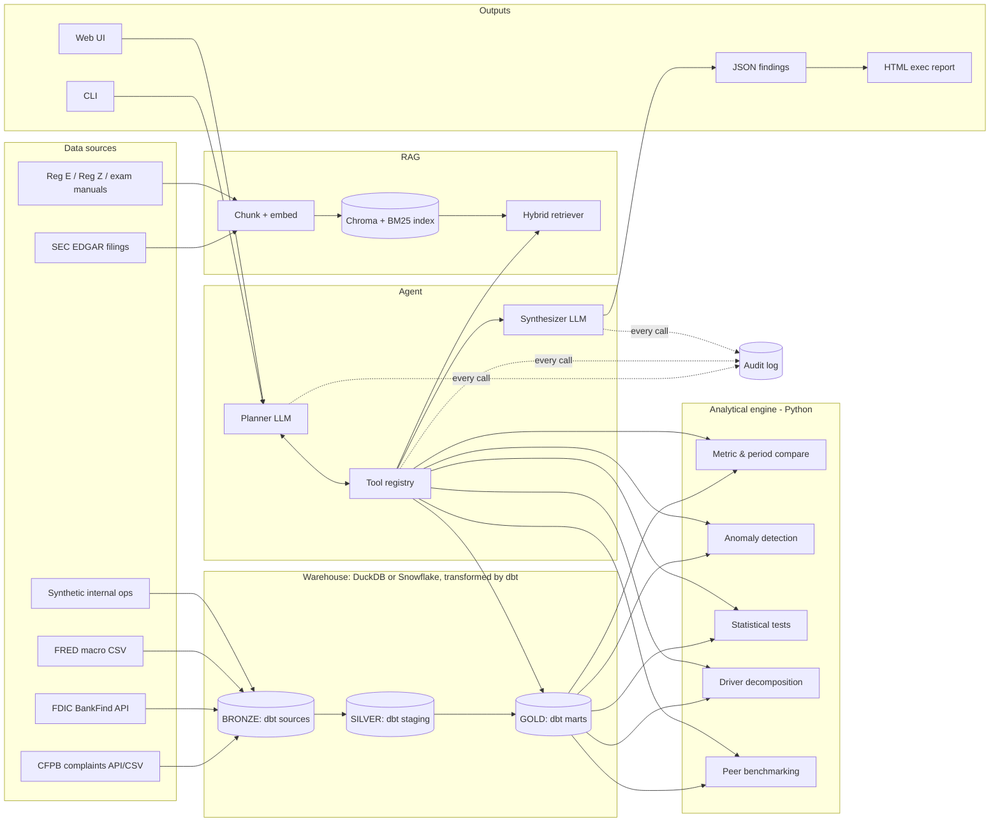
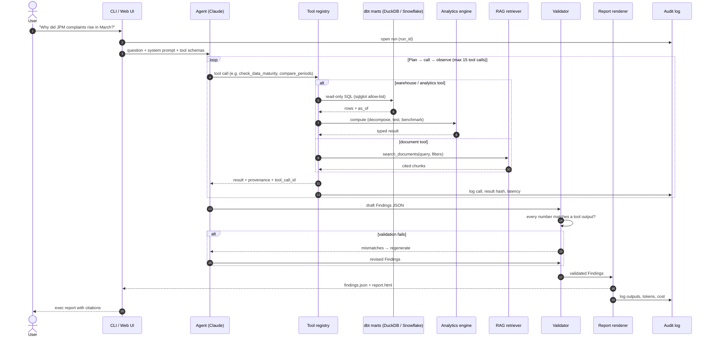
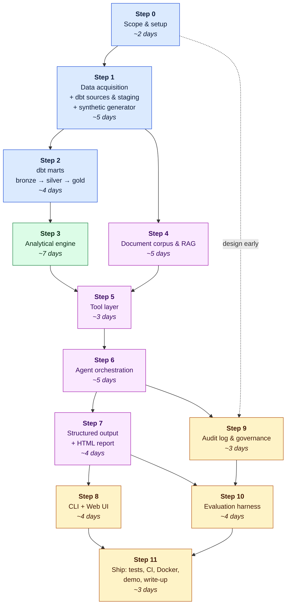

# Bank Operations Intelligence Agent

**An AI agent that answers "why did this number move?" for a retail bank's operations, and shows its work.**

> *"Why did complaint volume for JPMorgan Chase rise 14% in March versus February, and is it out of line with peers?"*

The agent queries a warehouse, finds anomalies, compares historical periods, runs statistical tests, pulls the relevant regulatory and internal documents, and has an LLM write up the findings. Every answer becomes an **HTML executive report** plus **structured JSON**, and every step goes into an **audit log**.

```
SQL / Snowflake → dbt → Python → analytical engine → LLM → RAG → tool calling → automated report → HTML UI → CLI → audit log
```

This is an **AI systems design** project, not a modeling exercise. The hard parts are deterministic analytics the LLM cannot fudge, grounded retrieval, tool contracts, traceability, and evaluation against known ground truth.

---

## Table of contents
1. [Problem statement](#1-problem-statement)
2. [Why a financial institution](#2-why-a-financial-institution)
3. [Data sources (verified)](#3-data-sources-verified)
4. [System architecture](#4-system-architecture)
5. [Build roadmap: step graph](#5-build-roadmap-step-graph)
6. [Steps and tasks](#6-steps-and-tasks)
7. [Question bank (what the agent must answer)](#7-question-bank)
8. [Repository layout](#8-repository-layout)
9. [Tech stack](#9-tech-stack)
10. [Design principles and guardrails](#10-design-principles-and-guardrails)
11. [Definition of done](#11-definition-of-done)

---

## 1. Problem statement

Bank operations, risk, and compliance teams spend hours each month explaining variance: complaint spikes, dispute volume, call-center load, charge-off moves, efficiency-ratio drift. The work is repetitive and has a fixed shape:

1. Pull the metric and its history
2. Slice it by product, issue, channel, and geography to find what moved
3. Check whether the move is statistically meaningful or noise
4. Compare against peers and macro conditions
5. Look up policy, regulation, and incident context
6. Write a memo for an executive

This project automates that loop with an agent that **uses tools rather than guessing**. The LLM plans, calls tools, and writes the narrative. Every number in the output comes from SQL or Python and can be traced in the audit log.

**Primary user:** a VP of Consumer Operations or a Head of Complaint Management at a large U.S. retail bank.
**Focal institution (configurable):** JPMorgan Chase, benchmarked against Bank of America, Wells Fargo, Citibank, and Capital One.

## 2. Why a financial institution

- **Real public data at the institution level.** The CFPB, FDIC, Federal Reserve, and SEC publish bank-level data for free with no login.
- **Audit and explainability matter here.** Model-risk guidance (Fed SR 11-7) and regulators expect traceable reasoning, which is why the audit log is a core feature.
- **There is a real regulatory corpus for RAG.** Reg E (electronic transfers and disputes), Reg Z (credit cards and lending), the CFPB supervision manual, and the FDIC risk manual give the documents the agent cites.
- **It exercises the full stack.** SQL, warehousing, statistics, LLM tooling, and governance in one system.

---

## 3. Data sources (verified)

All endpoints below were tested live on **2026-10-08**. See [`docs/DATA_SOURCES.md`](docs/DATA_SOURCES.md) for field-level detail, and run `scripts/fetch_data.py` to download them.

| # | Source | What it gives the agent | Grain | Volume | Access |
|---|--------|------------------------|-------|--------|--------|
| 1 | **CFPB Consumer Complaint Database** | The core "operational volume" signal: complaints by company, product, issue, sub-issue, state, channel, response, timeliness, plus free-text narratives | One row per complaint, daily | **18.3M rows** total; about 44.6k for JPMorgan Chase since Jan 2025 | REST API + bulk CSV (352 MB zip), CC0 license |
| 2 | **FDIC BankFind Suite API** | Quarterly call-report financials per bank: assets, deposits, loans, net income, ROA/ROE, NIM, efficiency ratio, net charge-off and noncurrent-loan ratios, non-interest income and expense | Bank × quarter (170 quarters for JPMorgan Chase) | Small | REST API, no key |
| 3 | **FRED (St. Louis Fed)** | Macro drivers: card and mortgage delinquency, fed funds, unemployment, 30-year mortgage rate, consumer credit, CPI, consumer sentiment | Monthly / quarterly | Small | CSV endpoint, no key |
| 4 | **SEC EDGAR** | 10-K and 10-Q filings (risk factors, MD&A text for RAG) and XBRL financial facts | Filing / quarter | Medium | REST API (needs a User-Agent header) |
| 5 | **Regulatory corpus** | Reg E (12 CFR 1005), Reg Z (12 CFR 1026), CFPB Supervision & Examination Manual, FDIC Risk Management Manual | Documents | About 2–5k pages | eCFR API + PDFs |
| 6 | **Synthetic internal ops data** *(generated by this repo)* | Call-center contacts, card disputes, digital-banking incidents, an internal policy wiki. Tied to real CFPB/FRED trends **with injected, labeled anomalies** | Daily | You choose | `scripts/generate_synthetic.py` (Step 1) |

**Why the synthetic layer?** No bank publishes its internal ops data. Generating it lets you (a) show "internal + external" joins the way a real bank would, and (b) **plant known anomalies**, such as "mobile app outage on 2026-03-12 drove a dispute spike." That gives you a **ground-truth answer key** to score the agent against (Step 10). Label it clearly as synthetic in the repo.

### Verified identifiers (peer group)

| Bank | FDIC CERT | CFPB `company` value | SEC CIK |
|------|-----------|----------------------|---------|
| JPMorgan Chase *(focal)* | 628 | `JPMORGAN CHASE & CO.` | 0000019617 |
| Bank of America | 3510 | `BANK OF AMERICA, NATIONAL ASSOCIATION` | 0000070858 |
| Wells Fargo | 3511 | `WELLS FARGO & COMPANY` | 0000072971 |
| Citibank | 7213 | `CITIBANK, N.A.` | 0000831001 |
| Capital One | 4297 | `CAPITAL ONE FINANCIAL CORPORATION` | 0000927628 |

### Data quirks the agent must handle

- **CFPB reporting lag.** (Seen live in the smoke pull: JPMorgan Chase showed 2,227 complaints for Aug 2026, 1,816 for Sep, and 20 for the first days of Oct.) Complaints are published after the company responds or after 15 days, so the **last 30–60 days are always undercounted**. An agent that reports "complaints fell 30% this month!" without a data-maturity check is wrong. Build a `data_maturity` check into the analytics tools.
- **Narratives are opt-in.** Only about half of complaints include consumer narratives, and they are scrubbed of PII. Treat narrative-based findings as a sample, not the population.
- **Complaint volume is not proportional to bank size.** Normalize complaints per $1B in deposits using FDIC data before comparing peers.
- **FDIC dollar values are in thousands.** `ASSET = 4091315000` means $4.09T.
- **Grain mismatch.** CFPB is daily, FDIC is quarterly, FRED is monthly or quarterly. The gold layer needs explicit calendar alignment.
- **Taxonomy changes.** CFPB product and issue labels were renamed (for example, in 2017 and 2023). You need a mapping table, or historical comparisons will show fake shifts.

---

## 4. System architecture



**Request lifecycle**



1. The user asks a question through the CLI or web UI. A `run_id` is created and logged.
2. The planner LLM (Claude, with tool use) breaks it into tool calls.
3. Tools run deterministic SQL and Python and return typed results with provenance (query text, row counts, data-as-of date).
4. RAG tools return cited document chunks.
5. The synthesizer LLM writes findings **constrained to the tool outputs**. A JSON schema is enforced, and every number must reference a `tool_call_id`.
6. A validator cross-checks the numbers in the narrative against the tool results, then the report renderer emits JSON and HTML.
7. Every prompt, tool call, result hash, token count, latency, and the final output goes to the audit log.

---

## 5. Build roadmap: step graph



**Critical path:** 0 → 1 → 2 → 3 → 5 → 6 → 7 → 10 → 11 (about 7 weeks part-time).
**Parallel track:** Step 4 (RAG) can be built while Steps 2–3 are in progress. Design the audit log schema (Step 9) in Step 0, even though you build it later.

**Milestones**
| Milestone | After step | Demo-able result |
|-----------|-----------|------------------|
| M1 "Data is real" | 2 | `dbt build` is green; `analyses/peer_complaints_last_12m.sql` shows complaints per $1B deposits for 5 banks |
| M2 "Engine finds the spike" | 3 | `python -m bankops.analytics explain --metric complaints --month 2026-03` prints drivers + p-values, no LLM |
| M3 "Agent answers" | 6 | CLI question in, grounded answer out, with tool trace |
| M4 "Exec-ready" | 8 | HTML report + web UI |
| M5 "Trustworthy" | 10 | Eval scorecard: driver recall, numeric accuracy, citation precision |

---

## 6. Steps and tasks

> Tick these off as you go. Each step ends with a **deliverable** and an **exit test**.

### Step 0: Scope and setup
- Pick the focal bank and peer set: **JPMorgan Chase (focal)** + Bank of America, Wells Fargo, Citibank, Capital One. Edit `dbt/seeds/bank_dim.csv` to change.
- Write 10 target questions in [`evals/questions.yaml`](evals/questions.yaml) (from the [question bank](#7-question-bank)). Each has expected tools, required caveats, failure modes, and reference SQL for scoring.
- [ ] Create the repo, `pyproject.toml`, virtual env, `ruff`, `pytest`, pre-commit
- Decide on the warehouse: **DuckDB locally** (free, fast) with a **Snowflake** target (30-day free trial for the demo). **dbt** owns every transform, so switching is `DBT_TARGET=snowflake`.
- [ ] Get an Anthropic API key and put it in `.env` (never commit it)
- [ ] Draft the audit-log event schema (`run_id`, `step`, `tool`, `input`, `output_hash`, `tokens`, `latency_ms`, `model`, `ts`)
- **Deliverable:** repo skeleton, config, question list. **Exit test:** `pytest` runs (empty) and `python scripts/fetch_data.py --smoke` passes.

### Step 1: Data acquisition and synthetic generator
- [ ] **CFPB:** download the bulk CSV (`complaints.csv.zip`, about 350 MB) to `data/raw/cfpb/`, then filter to the 5 peer banks (about 1.5–2M rows since 2015). Use the API for incremental daily refresh.
- [ ] **FDIC:** pull `/banks/financials` for the 5 CERTs, all quarters. Fields: `REPDTE, ASSET, DEP, LNLSNET, NETINC, ROA, ROE, NIMY, EEFFR, NTLNLSR, NCLNLSR, ELNATR, NONII, NONIX`
- [ ] **FRED:** pull `DRCCLACBS, DRSFRMACBS, FEDFUNDS, UNRATE, MORTGAGE30US, TOTALSL, CPIAUCSL, UMCSENT`
- [ ] **EDGAR:** for each CIK, download the latest 10-K plus the last 4 10-Qs (HTML), and XBRL `NoninterestExpense` and `ProvisionForLoanLeaseAndOtherLosses`
- [ ] Write a raw-landing manifest (`data/raw/_manifest.json`): source, URL, pulled_at, row count, sha256
- [ ] **Synthetic generator** (`scripts/generate_synthetic.py`, seeded and reproducible):
  - `call_center_contacts` (daily × reason × channel): baseline driven by real CFPB volume × 40 + weekday seasonality + noise
  - `card_disputes` (daily × reason_code × product): baseline tied to card volume + FRED card delinquency
  - `digital_incidents` (incident_id, start, end, system, severity, description)
  - **3–5 injected anomalies with a ground-truth file**, for example:
    1. 2026-03-12 mobile app outage (6h) → +35% "unauthorized transaction" disputes for 5 days
    2. Q2-2026 fee policy change → +20% "fees" complaints for checking
    3. A state-level fraud ring (TX) → card disputes spike in one state only
  - Internal markdown docs for RAG: incident post-mortems, a fee-schedule change memo, a dispute SOP. These are what the agent should retrieve to explain anomalies.
- **dbt: land and stage the pull** (in `dbt/`). dbt doesn't download data; `fetch_data.py` does. dbt starts the moment files land:
  - dbt project with `dbt-duckdb` (dev) and `dbt-snowflake` (demo) targets in `dbt/profiles.yml`. Credentials come only from env vars.
  - **Sources = bronze.** `models/staging/_sources.yml` reads the raw CSVs **in place** via DuckDB `external_location`, so no separate load script is needed in dev.
  - **Seeds = reference data.** `bank_dim.csv` (IDs across CFPB/FDIC/SEC) and `fred_series_dim.csv`
  - **Staging = silver.** `stg_cfpb__monthly_counts`, `stg_fdic__financials` (converts $ thousands to dollars), `stg_fred__observations` (wide to long)
  - Tests on sources and staging: not-null, unique, `relationships` to `bank_dim` (catches a bank whose name changed in CFPB)
  - [ ] Add `stg_cfpb__complaints` on the bulk CSV (unzip to `data/raw/cfpb/complaints.csv`), with dedupe on `complaint_id` and a `cfpb_taxonomy_map` seed for product/issue renames
  - [ ] Add `stg_synth__*` models once the synthetic generator exists
  - [ ] Source freshness: add `loaded_at_field` and `freshness` thresholds so `dbt source freshness` fails if the pull is stale
- **Deliverable:** `data/raw/` populated, `evals/ground_truth.yaml`, staging models green. **Exit test:** the manifest row counts match the API `total` counts, and `cd dbt && dbt build --select staging+` passes.

### Step 2: dbt marts (gold layer the agent queries)
Layering: **sources** (bronze) → **staging** (silver, 1:1 with sources) → **intermediate** (reshaping) → **marts** (gold). Agent tools may only query `marts.*`.
- `int_fdic__quarterly_flows`: de-cumulates FDIC year-to-date income and expense into true quarterly flows
- `fct_complaints_monthly`: complaints per bank per month, **as-of joined** to quarter-end deposits to give `complaints_per_1b_deposits`, plus MoM/YoY % and an **`is_mature` flag** for the CFPB reporting lag (`var('cfpb_maturity_days')`)
- `fct_bank_quarterly`: FDIC ratios with YoY deltas in percentage points
- `fct_macro_monthly`: FRED on a monthly spine; weekly series averaged, quarterly carried forward with an `is_carried_forward` flag
- Singular tests: no negative counts, every mature month finds deposits, ratios in plausible ranges
- [ ] `fct_complaints_daily(bank_id, date, product, issue, state, channel, n, n_timely, n_with_narrative)` from the bulk staging model, so Step 3 can decompose drivers
- [ ] `fct_ops_daily` (synthetic calls + disputes + incident flags)
- [ ] `dim_data_maturity(source, as_of, complete_through)`: one row per source, so tools can call `check_data_maturity` cheaply
- [ ] **Semantic layer:** column descriptions in the `_marts.yml` files feed `list_metrics()` / `describe_table()` in Step 5. dbt docs double as the LLM's schema context.
- [ ] `dbt docs generate` and screenshot the lineage graph for the README
- [ ] Snowflake: a small `scripts/load_snowflake.py` (PUT + COPY INTO a `RAW` schema), then `DBT_TARGET=snowflake dbt build`
- **Deliverable:** `dbt/` with marts and tests. **Exit test (M1):** `dbt build` passes and `dbt compile -s peer_complaints_last_12m` gives sensible numbers for all 5 banks.

### Step 3: Analytical engine (no LLM here)
Pure Python on top of gold marts. Every function returns a typed result (pydantic) with `value`, `method`, `sql`, `n`, and `as_of`.
- [ ] `compare_periods(metric, bank, p1, p2, dims)`: absolute and % change, with mix shift vs. rate effects
- [ ] `decompose_change(metric, bank, p1, p2, dim)`: **contribution analysis**. Which product, issue, or state explains X% of the delta?
- [ ] `detect_anomalies(series)`: STL decomposition + robust z-score (MAD); flag points above 3σ. Optional: Prophet or seasonal ESD.
- [ ] `test_significance(...)`: Poisson/negative-binomial rate test for counts, chi-square for mix changes, Mann-Whitney for distributions. **Report effect size, not only the p-value.**
- [ ] `peer_benchmark(metric, period)`: focal vs. peer median, z-score within the peer group, per-$1B normalization
- [ ] `macro_context(period)`: correlate the metric with FRED drivers (lagged), with an explicit "correlation ≠ cause" flag
- [ ] `data_maturity_check(source, period)`: warn if the period falls inside the CFPB reporting-lag window
- [ ] Unit tests on fixtures, including verifying the engine **finds every injected anomaly** in the synthetic data
- **Deliverable:** `src/bankops/analytics/`. **Exit test (M2):** the engine's CLI ranks the planted 2026-03 dispute spike as the #1 driver, with p < 0.01.

### Step 4: Document corpus and RAG (parallel with Steps 2–3)
- [ ] Collect: Reg E (12 CFR 1005) and Reg Z (12 CFR 1026) from the eCFR API, the CFPB Supervision & Examination Manual (complaint-management module), FDIC RMS Manual sections, 10-K risk factors and MD&A for the 5 banks, plus the synthetic internal docs from Step 1
- [ ] Parse: HTML/PDF → clean text, keeping section headers and citation IDs (e.g. `12 CFR 1005.11(c)`)
- [ ] Chunk: structure-aware (by regulation section or 10-K Item), about 500–800 tokens, with metadata `{source, doc_type, bank_id, section, effective_date, url}`
- [ ] Embed with `fastembed` (`BAAI/bge-small-en-v1.5`, ONNX, CPU-only, no torch) and store in **Chroma** (`chromadb.PersistentClient` at `data/corpus/chroma/`), one collection per corpus: `regulations`, `filings`, `internal_docs`
- [ ] Keyword index: `rank-bm25` over the same chunks (Chroma has no built-in BM25), so exact citations like `1005.11(c)` and terms like "provisional credit" still match
- [ ] Retrieve: **hybrid**. Query Chroma (vector, with `where` metadata filters on bank, doc_type, date ≤ period) and BM25 in parallel, merge with reciprocal rank fusion, then rerank the top 20 with a `fastembed` cross-encoder
- [ ] Keep all retrieval behind `src/bankops/rag/retriever.py` so tools never import Chroma directly. Snowflake Cortex Search can be added later as a second backend for the Snowflake demo.
- [ ] Also index **complaint narratives** as a separate collection so the agent can quote representative customer language (sampled, PII already scrubbed by CFPB)
- [ ] Retrieval eval: 25 hand-labeled query→relevant-chunk pairs; track recall@5 and MRR
- **Deliverable:** `src/bankops/rag/`. **Exit test:** "What are the timing requirements for resolving an error dispute?" retrieves `12 CFR 1005.11(c)` in the top 3.

### Step 5: Tool layer
Wrap Steps 2–4 as **LLM-callable tools** with strict JSON schemas.
- [ ] `run_sql(query)`: **read-only**, allow-listed schemas (`gold.*`), row limit, timeout, SQL parsed with `sqlglot` to block DDL/DML
- [ ] `get_metric_series`, `compare_periods`, `decompose_change`, `detect_anomalies`, `test_significance`, `peer_benchmark`, `macro_context`, `check_data_maturity`
- [ ] `search_documents(query, filters)`, `search_complaint_narratives(query, bank, period)`
- [ ] `list_metrics()` / `describe_table()`: a semantic layer so the LLM doesn't guess column names
- [ ] Each tool returns `{result, provenance: {sql, rows, as_of, source}, tool_call_id}`
- [ ] Contract tests: invalid inputs fail cleanly with useful errors the LLM can recover from
- **Deliverable:** `src/bankops/tools/registry.py`. **Exit test:** every tool callable from a pytest with schema validation.

### Step 6: Agent orchestration
- [ ] Use the **Anthropic Messages API with tool use** (Claude). Write the tool loop yourself first (about 150 lines) to understand it, then optionally compare with a framework.
- [ ] System prompt: role (bank ops analyst), rules ("never state a number not returned by a tool", "always check data maturity", "always normalize for peer comparisons", "cite documents by ID")
- [ ] Planner pattern: clarify the metric and period → pull the series → compare → decompose → test → benchmark → macro → retrieve docs → synthesize
- [ ] Guardrails: max tool calls (e.g. 15), max tokens and cost per run, loop detection, refusal when data doesn't support an answer
- [ ] Use prompt caching for the system prompt and tool definitions
- [ ] Model routing: a cheaper model for planning and simple lookups, a stronger model for final synthesis
- **Deliverable:** `src/bankops/agent/`. **Exit test (M3):** the 10 target questions all complete with a tool trace and no ungrounded numbers.

### Step 7: Structured output and HTML report
- [ ] Pydantic `Findings` schema: `headline`, `metric_change{value, pct, p_value, effect_size}`, `drivers[]{dimension, contribution_pct, evidence_tool_call_id}`, `peer_context`, `macro_context`, `caveats[]` (data maturity, sample size), `citations[]`, `recommended_actions[]`, `confidence`
- [ ] **Numeric validator:** regex-extract every number in the narrative, then match it to a tool output within tolerance. If it fails, regenerate or flag it.
- [ ] HTML report (Jinja2 + Plotly): exec summary, KPI tiles, trend chart with the anomaly marked, driver waterfall, peer bar chart, cited sources, an appendix with the tool trace
- [ ] Save `reports/{run_id}/findings.json`, `report.html`, `trace.json`
- **Deliverable:** `src/bankops/reporting/`. **Exit test:** a report renders offline and passes the numeric validator.

### Step 8: CLI and web UI
- [ ] CLI (Typer + Rich): `bankops ask "..."`, `bankops report --metric complaints --bank jpm --month 2026-03`, `bankops anomalies --since 2026-01`, `bankops audit show <run_id>`, `bankops refresh-data`
- [ ] Web UI (FastAPI + HTMX, or Streamlit for speed): question box, streaming tool trace ("Querying gold.complaints_monthly…"), rendered report, run history
- [ ] Scheduled mode: a monthly cron job that auto-generates "Top 5 anomalies this month" for the focal bank
- **Deliverable:** `src/bankops/cli/`, `src/bankops/web/`. **Exit test (M4):** a non-technical user can get a report in under 60 seconds.

### Step 9: Audit log and governance
- [ ] Append-only event log (a SQLite/DuckDB table + JSONL mirror): `run_id, parent_id, ts, actor, event_type (prompt|tool_call|tool_result|llm_output|validation|report), model, input, output_sha256, tokens_in/out, cost_usd, latency_ms`
- [ ] Hash-chain events (each row includes the previous row's hash) so tampering is detectable. This is a good governance talking point.
- [ ] PII handling: log redaction pass, no raw narratives stored in prompts beyond retrieved excerpts
- [ ] `bankops audit replay <run_id>`: re-run with the same tool outputs to reproduce the report
- [ ] A short **Model Risk** doc (`docs/MODEL_RISK.md`) in SR 11-7 style: intended use, limitations, monitoring, human-in-the-loop
- **Deliverable:** `src/bankops/audit/`. **Exit test:** every number in any report traces to a SQL query in the log.

### Step 10: Evaluation harness
- [ ] **Driver recall:** for each injected anomaly in `evals/ground_truth.yaml`, did the agent name the right driver(s)?
- [ ] **Numeric accuracy:** % of narrative numbers matching tool outputs (target 100%)
- [ ] **Citation precision:** are cited docs actually relevant? (LLM-as-judge + spot human labels)
- [ ] **Caveat compliance:** did it warn about CFPB lag when asking about the latest month?
- [ ] **Refusal tests:** unanswerable or out-of-scope questions ("What will JPM's stock do?") must be declined
- [ ] **Cost and latency** per question; track over versions
- [ ] Output an eval scorecard as `reports/eval_scorecard.html`
- **Deliverable:** `evals/run_evals.py`. **Exit test (M5):** scorecard committed and linked from this README.

### Step 11: Ship
- [ ] Tests: unit (analytics), contract (tools), integration (agent with recorded LLM responses), with a coverage badge
- [ ] GitHub Actions: lint, tests, a small eval subset on PR
- [ ] Dockerfile + `docker compose up` that brings up the web UI with DuckDB and a small sample dataset (so reviewers can run it without downloading 350 MB)
- [ ] `make demo`: one command that builds the sample warehouse and answers 3 showcase questions
- [ ] README polish: GIF of the CLI, screenshot of the HTML report, architecture diagram, eval results table
- [ ] Write-up / blog post: "Designing an auditable analytics agent for bank operations"

---

## 7. Question bank

Tailored to the verified data. Each maps to the tools it should trigger.

| # | Question | Exercises |
|---|----------|-----------|
| 1 | Why did JPMorgan Chase's complaint volume change in March 2026 vs. February? | compare, decompose, significance, data maturity |
| 2 | Which product/issue combos for Capital One are anomalous in the last 6 months? | anomaly detection |
| 3 | Is Wells Fargo's checking-account fee complaint rate out of line with peers per $1B deposits? | peer benchmark, FDIC join |
| 4 | Did rising card delinquency (FRED DRCCLACBS) coincide with more credit-card complaints across the peer group? | macro context, correlation caveats |
| 5 | Which states drove Bank of America's YoY change in "Problem with a purchase shown on your statement"? | decompose by state |
| 6 | What does Reg E require for resolving the dispute types that spiked, and are timely-response rates compliant? | RAG + `timely` field |
| 7 | Why did card disputes spike in mid-March 2026? *(synthetic ground truth: app outage)* | internal ops + incident RAG |
| 8 | How did Citibank's efficiency ratio and net charge-off rate move over the last 4 quarters vs. peers? | FDIC quarterly |
| 9 | Summarize the top 3 operational risks this month for the COO, with evidence. | full pipeline, report |
| 10 | What will JPM's stock price be next quarter? | **must refuse / out of scope** |

---

## 8. Repository layout

```
bank-ops-ai-agent/
├── README.md                 ← you are here
├── config/
│   └── institutions.yaml     ← fetch settings (history start, FDIC fields, regs)
├── docs/
│   ├── DATA_SOURCES.md       ← endpoints, fields, quirks
│   └── MODEL_RISK.md         ← (Step 9)
├── scripts/
│   ├── fetch_data.py         ← pulls CFPB / FDIC / FRED / EDGAR
│   └── generate_synthetic.py ← (Step 1) internal ops + injected anomalies
├── dbt/                      ← all warehouse transforms
│   ├── models/staging/       ← _sources.yml (bronze) + stg_* (silver)
│   ├── models/intermediate/  ← int_* reshaping
│   ├── models/marts/         ← fct_* (gold; the only layer tools query)
│   ├── seeds/                ← bank_dim, fred_series_dim
│   ├── tests/                ← singular data tests
│   └── analyses/             ← ad-hoc SQL (M1 check)
├── src/bankops/
│   ├── analytics/  rag/
│   ├── tools/   agent/      reporting/
│   ├── cli/     web/        audit/
├── evals/                    ← questions.yaml, ground_truth.yaml, run_evals.py
├── tests/
├── data/      (git-ignored)  ← raw/, processed/, corpus/
├── reports/   (git-ignored)  ← generated outputs
└── logs/      (git-ignored)  ← audit log
```

## 9. Tech stack

| Layer | Choice | Why |
|-------|--------|-----|
| Warehouse | **DuckDB** (dev) / **Snowflake** (demo) | Same SQL; free locally; Snowflake on the résumé |
| Transforms | **dbt** (`dbt-duckdb` dev / `dbt-snowflake` demo) | Tested, documented, lineage-tracked SQL; docs double as the agent's semantic layer |
| Analytics | pandas / polars, statsmodels, scipy | Deterministic and testable |
| LLM | **Claude via Anthropic SDK** (tool use, prompt caching) | Native tool calling and structured output |
| RAG | **Chroma** + BM25 (`rank-bm25`) + `fastembed` embeddings and reranker | Simple local vector store with metadata filters; BM25 catches exact citations; no GPU or torch needed |
| Schemas | pydantic v2 | Tool I/O contracts and the findings schema |
| SQL safety | sqlglot | Parse and allow-list before execution |
| Report | Jinja2 + Plotly | Self-contained HTML |
| CLI / Web | Typer + Rich / FastAPI + HTMX (or Streamlit) | |
| Audit | DuckDB/SQLite table + JSONL, hash chain | |
| Quality | pytest, ruff, GitHub Actions, Docker | |

## 10. Design principles and guardrails

1. **The LLM never does math.** All numbers come from tools; a validator enforces it.
2. **Every claim has provenance:** a SQL query, a document chunk ID, or a `tool_call_id`.
3. **Know what you don't know.** Data-maturity, sample-size, and correlation-vs-causation caveats are part of the schema, not optional prose.
4. **Read-only by design.** The agent cannot write to the warehouse; SQL is parsed and allow-listed.
5. **Reproducible.** Seeded synthetic data, pinned data snapshots, and `audit replay`.
6. **Cheap by default.** Caching, model routing, tool-call budgets, and cost logged per run.

## 11. Definition of done

- [ ] `docker compose up` → working web UI on sample data in under 5 minutes
- [ ] 10 benchmark questions answered with tool traces and HTML reports committed in `reports/examples/`
- [ ] Eval scorecard: driver recall ≥ 80%, numeric grounding = 100%, refusal tests pass
- [ ] Audit log can replay any run
- [ ] README has a demo GIF, architecture diagram, and results table

---

*Data: CFPB Consumer Complaint Database (CC0), FDIC BankFind Suite, FRED (Federal Reserve Bank of St. Louis), SEC EDGAR, and eCFR. Synthetic internal data is generated and clearly labeled; it does not represent any real institution's internal operations.*
